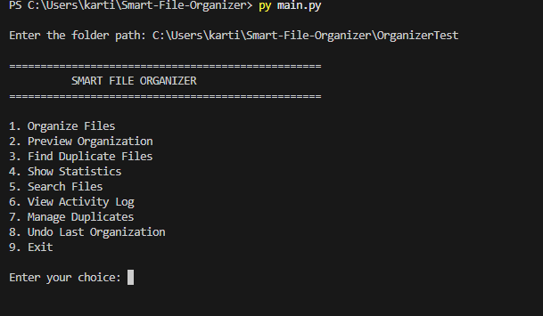
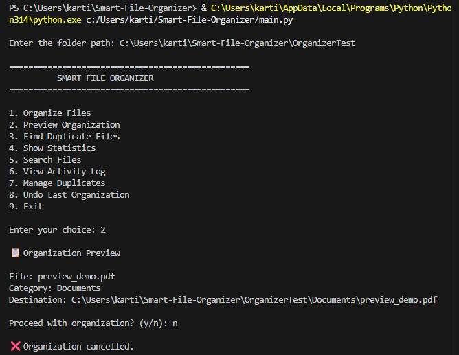
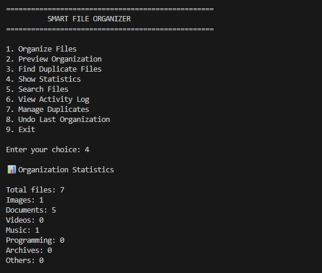
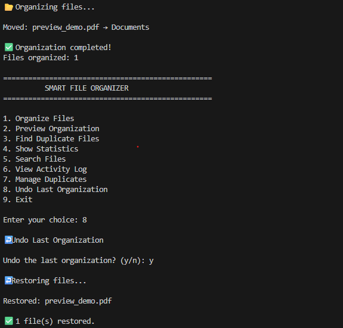

# 📂 Smart File Organizer

A Python-based file management application that automatically organizes files into categories, detects duplicate files, provides file statistics and search, maintains an activity log, and supports undoing the last organization.

## 📸 Screenshots

### 🖥️ Main Menu



### 📋 Organization Preview



### 📊 File Statistics



### ↩️ Undo Organization


## 🚀 Features

- 📂 Automatic File Organization
- 📋 Preview Organization Before Moving Files
- 🔁 Duplicate File Detection using SHA-256
- 🗑️ Safe Duplicate Management
- 📊 File Statistics
- 🔎 File Search
- 📝 Activity Logging
- ↩️ Undo Last Organization
- 🛡️ Error Handling
- 📁 Folder Validation
- 🖥️ Interactive Command-Line Interface

## 🛠️ Technologies Used

- Python 3
- OS module
- shutil
- hashlib
- File System Operations
- SHA-256 Hashing

## 📁 Project Structure

```text
Smart-File-Organizer/
│
├── core/
│   ├── __init__.py
│   ├── organizer.py
│   ├── duplicate.py
│   ├── statistics.py
│   ├── search.py
│   ├── preview.py
│   └── logger.py
│
├── main.py
├── README.md
└── .gitignore